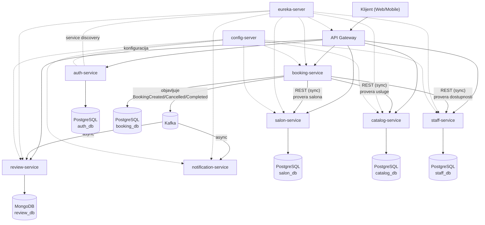

# Salon Booking System — dokumentacija projekta

Projekat za predmet **Distribuirani informacioni sistemi**. Sistem za online
zakazivanje termina u salonima lepote (frizerski, kozmetički, nail salon...),
razvijen kao mikroservisna arhitektura po uzoru na knjigu
*"Hands-On Microservices with Spring Boot and Spring Cloud"*.

> Status: projekat se gradi inkrementalno, deo po deo (commit po commit).
> Ovaj dokument se ažurira posle svakog dela. Trenutno završeno: **Deo 1 —
> osnovna struktura projekta, `salon-service`, dokumentacija, docker-compose
> skelet, CI pipeline (build/test).** **Deo 2 — `auth-service`** (registracija,
> login, JWT, hashovanje lozinki preko BCrypt-a).

## 1. Opis poslovne logike sistema

Sistem povezuje tri tipa korisnika:

- **Klijent** — pretražuje salone i usluge, zakazuje termin kod odabranog
  zaposlenog (frizera, kozmetičara...), otkazuje termin, ostavlja recenziju
  posle završenog termina.
- **Vlasnik salona** — upravlja podacima o svom salonu, katalogom usluga
  (naziv, trajanje, cena) i zaposlenima (radno vreme, dostupnost).
- **Zaposleni u salonu** — ima svoj raspored termina.

### Poslovni tok zakazivanja (booking flow)

1. Klijent se registruje/prijavljuje (**auth-service**) i pretražuje salone
   po gradu (**salon-service**) i usluge koje salon nudi (**catalog-service**).
2. Klijent bira uslugu, zaposlenog i termin. **booking-service** (orkestrator)
   sinhrono proverava kod **staff-service** da li je zaposleni slobodan u
   traženom terminu i kod **catalog-service**/**salon-service** da usluga i
   salon zaista postoje, zatim upisuje rezervaciju.
3. Kada je rezervacija kreirana, **booking-service** asinhrono emituje
   događaj `BookingCreated` na message broker (Kafka).
4. **notification-service** sluša događaje i (simulirano) šalje
   email/SMS potvrdu klijentu.
5. Kada termin prođe, booking prelazi u status `COMPLETED`
   (`BookingCompleted` događaj) — tek tada **review-service** dozvoljava
   klijentu da ostavi recenziju za taj termin/zaposlenog/salon.
6. Otkazivanje termina (`BookingCancelled`) oslobađa slot kod
   **staff-service** i obaveštava klijenta/salon asinhrono.

Ovaj tok namerno kombinuje **sinhronu komunikaciju** (REST, tamo gde je
odgovor odmah neophodan — npr. provera dostupnosti pre potvrde rezervacije)
i **asinhronu komunikaciju** (event-driven, tamo gde odgovor ne mora biti
trenutan — notifikacije, ažuriranje statusa, omogućavanje recenzije), što je
i eksplicitan zahtev projekta.

## 2. Mikroservisi (7 + infrastrukturne komponente)

| # | Mikroservis | Poslovna odgovornost | Baza | Komunikacija |
|---|---|---|---|---|
| 1 | **auth-service** | Registracija/login, JWT tokeni, uloge (CLIENT, SALON_OWNER, STAFF, ADMIN) | PostgreSQL | REST (sync) |
| 2 | **salon-service** | CRUD salona (naziv, adresa, grad, radno vreme, vlasnik) | PostgreSQL | REST (sync) |
| 3 | **catalog-service** | Katalog usluga po salonu (naziv, trajanje, cena) | PostgreSQL | REST (sync) |
| 4 | **staff-service** | Zaposleni, specijalizacije, raspored/dostupnost | PostgreSQL | REST (sync) |
| 5 | **booking-service** | Orkestracija zakazivanja, status termina, izdavač događaja | PostgreSQL | REST (sync, poziva 2-4) + Kafka producer (async) |
| 6 | **review-service** | Recenzije i ocene salona/zaposlenih | MongoDB | REST (sync, čitanje) + Kafka consumer (async) |
| 7 | **notification-service** | Slanje email/SMS notifikacija | — (stateless) | Kafka consumer (async) |

Infrastrukturne komponente (neophodne za rad sistema u produkciji, ne
računaju se u 7 poslovnih mikroservisa):

- **eureka-server** — service discovery/registry.
- **config-server** — centralizovana konfiguracija (Spring Cloud Config,
  `config-repo` folder).
- **gateway** — API Gateway (Spring Cloud Gateway), jedina javna ulazna
  tačka, rutira ka servisima preko Eureke, proverava JWT.
- **Kafka + Zookeeper** — message broker za asinhronu komunikaciju.
- **Prometheus + Grafana** *(bonus)* — monitoring performansi.

### Dijagram arhitekture



*(Eureka i Config server strelice su isprekidane jer predstavljaju
infrastrukturnu, a ne poslovnu komunikaciju.)*

## 3. Tehnologije

- **Java 17**, **Spring Boot 3.3**, **Spring Cloud 2023.0.x (Leaf)**
- **Gradle** (multi-module build — `api`, `util`, `microservices/*`,
  `spring-cloud/*`), isti obrazac organizacije kao u pratećoj knjizi.
- Spring Data JPA + PostgreSQL (relacioni servisi), Spring Data MongoDB
  (review-service — polyglot persistence, isto kao u knjizi).
- Spring Cloud Netflix Eureka (discovery), Spring Cloud Config,
  Spring Cloud Gateway, Resilience4j (circuit breaker + retry na sinhronim
  pozivima booking-service-a).
- Apache Kafka (Spring Cloud Stream) za asinhronu komunikaciju.
- JWT (Spring Security) za autentifikaciju/autorizaciju.
- JUnit 5 + Mockito (unit testovi), Testcontainers (integracioni testovi sa
  pravim Postgres/Mongo/Kafka kontejnerima).
- Docker + Docker Compose (svaka komponenta kontejnerizovana).
- GitHub Actions (CI/CD pipeline).
- *(Bonus)* Prometheus + Grafana za monitoring.

## 4. Uputstvo za pipeline (build/test/deploy)

> Ova sekcija se dopunjava kako dodajemo delove sistema. Trenutno pokriva
> ono što je implementirano u Delu 1.

### Razvojno okruženje (dev)

Preduslovi: Docker + Docker Compose, JDK 17 (za lokalno pokretanje van
kontejnera).

```bash
# 1. Build svih modula i pokretanje testova
./gradlew build

# 2. Pokretanje samo salon-service-a lokalno (bez Dockera), sa lokalnim Postgresom
./gradlew :microservices:salon-service:bootRun

# 3. Pokretanje kompletnog dev okruženja kroz Docker Compose
docker compose up --build
```

`docker compose up` diže: `salon-service` + `salon-db`, i `auth-service` +
`auth-db` (svaki servis ima svoju bazu, svaka na svom portu na hostu:
salon-db `5433`, auth-db `5434`, da se ne bi sudarali sa lokalnim
Postgres-om ako ga imaš na `5432`). Ostale komponente (catalog, staff,
booking, review, notification, eureka, config-server, gateway, kafka)
dodaju se u narednim delovima projekta i biće uključene u isti
`docker-compose.yml`.

### auth-service - brzi test

```bash
# Registracija
curl -X POST http://localhost:8082/auth/register \
  -H "Content-Type: application/json" \
  -d '{"firstName":"Mina","lastName":"M","email":"mina@example.com","password":"lozinka123","role":"CUSTOMER"}'

# Login (vraca JWT token)
curl -X POST http://localhost:8082/auth/login \
  -H "Content-Type: application/json" \
  -d '{"email":"mina@example.com","password":"lozinka123"}'
```

### Testiranje

```bash
# Unit testovi (brzi, bez spoljnih zavisnosti)
./gradlew test

# Integracioni testovi (koriste Testcontainers - potreban je pokrenut Docker)
./gradlew :microservices:salon-service:test
```

### CI (GitHub Actions)

Na svaki `push`/`pull request` ka `main` grani, `.github/workflows/ci.yml`
automatski:

1. Podiže Java 17 okruženje.
2. Pokreće `./gradlew build` (kompajlira sve module).
3. Pokreće unit i integracione testove (Docker je dostupan na GitHub Actions
   runneru, pa Testcontainers integracioni testovi rade i u CI-ju).

### Produkcija (plan za naredne delove)

U narednim delovima dodaćemo:

- `docker-compose.yml` profil/varijantu za produkciju (odvojene env
  varijable, resource limits, restart policy).
- CD korak koji builduje Docker image za svaki servis i pushuje ga na
  registry (GHCR) posle uspešnog builda na `main` grani.
- *(Opciono)* Kubernetes manifeste za deploy na klaster.

## 5. Plan preostalih delova (roadmap)

- [x] Deo 1: struktura projekta, `api`/`util` moduli, `salon-service`
      (potpuna implementacija + testovi), docker-compose skelet, CI.
- [x] Deo 2: `auth-service` (registracija, login, JWT, BCrypt hashovanje
      lozinki, testovi).
- [ ] Deo 3: `catalog-service`, `staff-service`.
- [ ] Deo 4: `booking-service` (orkestracija, sync pozivi, Kafka producer,
      Resilience4j).
- [ ] Deo 5: `review-service`, `notification-service` (Kafka consumeri).
- [ ] Deo 6: `eureka-server`, `config-server`, `gateway`.
- [ ] Deo 7: Prometheus + Grafana monitoring, finalni docker-compose,
      finalizacija CI/CD pipeline-a (build/test/deploy za dev i produkciju).
