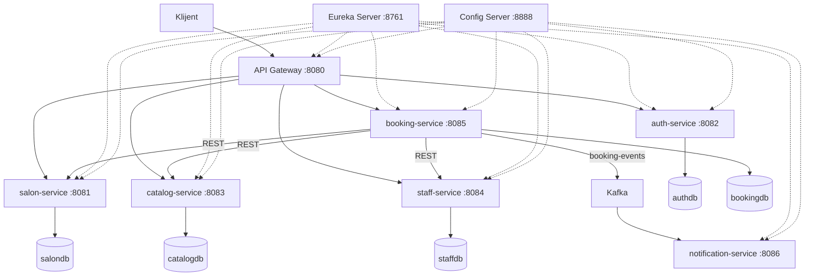

# Salon Booking System — dokumentacija projekta

Projekat je rađen za predmet **Distribuirani informacioni sistemi**.

Aplikacija predstavlja sistem za zakazivanje termina u salonima lepote. Sistem je razvijen kao skup mikroservisa korišćenjem Spring Boot i Spring Cloud tehnologija. Kao osnova za organizaciju projekta korišćeni su primeri i principi iz knjige _Hands-On Microservices with Spring Boot and Spring Cloud_.

## 1. Opis sistema

Sistem omogućava korisnicima da pronađu salon i uslugu, izaberu zaposlenog i zakažu termin.

U sistemu postoje tri osnovne uloge:

- **Klijent** — registruje se, prijavljuje, pretražuje salone i usluge, zakazuje i otkazuje termine.
- **Vlasnik salona** — upravlja podacima o salonu, uslugama i zaposlenima.
- **Zaposleni** — ima definisane podatke, specijalizaciju i radno vreme.

### Tok zakazivanja termina

Korisnik se prvo registruje ili prijavljuje preko `auth-service`-a. Nakon prijave dobija JWT token i odgovarajuću ulogu.

Podaci o salonima nalaze se u `salon-service`-u, dok `catalog-service` čuva usluge koje određeni salon nudi.

Kada korisnik želi da zakaže termin, bira salon, uslugu, zaposlenog i početno vreme termina. Zahtev zatim obrađuje `booking-service`.

Pre nego što se rezervacija sačuva, `booking-service` proverava:

1. da li salon postoji,
2. da li izabrana usluga postoji i pripada tom salonu,
3. da li je usluga aktivna,
4. koliko usluga traje,
5. da li zaposleni tada radi,
6. da li zaposleni već ima drugi termin u tom periodu.

Vreme završetka termina se ne šalje iz klijentske aplikacije, već ga `booking-service` računa na osnovu trajanja usluge.

Ako su sve provere uspešne, rezervacija dobija status `CONFIRMED`.

Nakon kreiranja rezervacije `booking-service` objavljuje `BOOKING_CREATED` događaj na Kafku. `notification-service` prima taj događaj i obrađuje notifikaciju.

Kod otkazivanja rezervacije status se menja u `CANCELLED` i šalje se događaj `BOOKING_CANCELLED`.

Kada je termin završen, status se menja u `COMPLETED` i šalje se `BOOKING_COMPLETED`.

### Organizacija podataka

Svaki servis koji čuva podatke ima svoju PostgreSQL bazu.

Servisi ne pristupaju direktno bazama drugih servisa. Na primer, `booking-service` čuva `salonId`, `serviceId` i `staffId`, ali podatke o salonu, usluzi i zaposlenom dobija preko REST poziva.

U rezervaciji se dodatno čuvaju naziv usluge i cena koja je važila u trenutku zakazivanja. Na taj način promena cene usluge kasnije ne utiče na već postojeće rezervacije.

---

## 2. Dijagram sistema



Pune strelice predstavljaju komunikaciju vezanu za poslovnu logiku, dok su isprekidanim strelicama prikazane infrastrukturne veze prema Eureka i Config Server komponentama.

---

## 3. Mikroservisi

Sistem trenutno sadrži **6 poslovnih mikroservisa**.

| Mikroservis            | Uloga                                   | Baza                | Port |
| ---------------------- | --------------------------------------- | ------------------- | ---: |
| `auth-service`         | registracija, login, JWT i uloge        | `authdb`            | 8082 |
| `salon-service`        | podaci o salonima                       | `salondb`           | 8081 |
| `catalog-service`      | usluge salona, trajanje i cena          | `catalogdb`         | 8083 |
| `staff-service`        | zaposleni i radno vreme                 | `staffdb`           | 8084 |
| `booking-service`      | zakazivanje i upravljanje rezervacijama | `bookingdb`         | 8085 |
| `notification-service` | obrada događaja sa Kafke                | nema sopstvenu bazu | 8086 |

Zahtev projekta je minimum pet mikroservisa vezanih za poslovnu logiku, tako da je ovaj uslov ispunjen.

### Infrastrukturne komponente

Pored poslovnih servisa, sistem koristi:

| Komponenta      | Namena                                |
| --------------- | ------------------------------------- |
| `eureka-server` | registracija i pronalaženje servisa   |
| `config-server` | centralizovana konfiguracija          |
| `gateway`       | jedinstvena ulazna tačka u sistem     |
| Kafka           | asinhrona komunikacija između servisa |
| PostgreSQL      | baze podataka mikroservisa            |

### Zajednički moduli

Projekat sadrži i dva zajednička Gradle modula:

- `api` — DTO klase i API interfejsi koje dele servisi,
- `util` — zajednički izuzeci i centralizovano rukovanje greškama.

Struktura repozitorijuma je približno:

```text
api/
util/

microservices/
    auth-service/
    salon-service/
    catalog-service/
    staff-service/
    booking-service/
    notification-service/

spring-cloud/
    eureka-server/
    config-server/
    gateway/

config-repo/

docs/
    OBJASNJENJA.md

.github/workflows/
    ci.yml

docker-compose.yml
docker-compose.prod.yml
.env.prod.example
```

---

## 4. Komunikacija između servisa

U projektu se koriste i sinhrona i asinhrona komunikacija.

### Sinhrona komunikacija

Sinhrona komunikacija se koristi u situacijama kada `booking-service` mora odmah da dobije odgovor da bi mogao da nastavi obradu zahteva.

Pri zakazivanju termina on poziva:

- `salon-service`,
- `catalog-service`,
- `staff-service`.

Pozivi se obavljaju preko REST-a.

Servisi se ne pozivaju preko fiksnih portova, već preko imena registrovanih u Eureki. Na primer:

```java
http://staff-service/staff/{id}/availability
```

`@LoadBalanced RestTemplate` preko Spring Cloud LoadBalancer-a pronalazi odgovarajuću instancu servisa.

Za pozive su podešeni i timeout-i kako zahtev ne bi dugo čekao ako neki servis nije dostupan.

### Asinhrona komunikacija

Za notifikacije se koristi Kafka i Spring Cloud Stream.

`booking-service` objavljuje događaje na topic:

```text
booking-events
```

Koriste se događaji:

```text
BOOKING_CREATED
BOOKING_CANCELLED
BOOKING_COMPLETED
```

`notification-service` je consumer ovih događaja.

Njegova consumer grupa je:

```yaml
group: notification-group
```

Kao ključ Kafka poruke koristi se `bookingId`, tako da događaji koji pripadaju istoj rezervaciji ostaju u pravilnom redosledu.

Ukoliko obrada poruke više puta ne uspe, poruka može biti prebačena u dead-letter topic kako ne bi blokirala ostale poruke.

---

## 5. Otpornost na otkaze

`booking-service` zavisi od nekoliko drugih servisa, pa je na tim pozivima dodat Resilience4j.

Koriste se:

- `Retry`
- `CircuitBreaker`
- fallback metode

`Retry` pokušava ponovni poziv ako se desi privremena greška.

`CircuitBreaker` prekida dalje pozive prema servisu koji duže vreme ne odgovara, kako ostali zahtevi ne bi čekali timeout.

Ako udaljeni servis vrati `404`, to se ne smatra kvarom servisa, već informacijom da traženi resurs ne postoji.

Ako servis nije dostupan, klijentu se vraća `503 Service Unavailable`.

Kod provere zaposlenog sam odlučila da se rezervacija ne kreira ukoliko nije moguće proveriti njegovu dostupnost, kako se ne bi napravila dva termina u istom periodu.

Konfiguracija za `booking-service` nalazi se u centralnom `config-repo` folderu.

---

## 6. Spring Cloud komponente

### Eureka Server

Eureka služi za service discovery.

Svaki servis se prilikom pokretanja registruje pod svojim imenom. Zbog toga servisi ne moraju da znaju konkretne IP adrese i portove drugih servisa.

Isti princip koristi i Gateway kroz `lb://` rute.

### Config Server

Config Server služi za izdvajanje zajedničke konfiguracije van samih mikroservisa.

Servisi koriste:

```yaml
spring.config.import: optional:configserver:${CONFIG_SERVER_URL:http://localhost:8888}
```

U projektu je Config Server podešen u `native` režimu i konfiguraciju čita iz `config-repo` foldera.

### API Gateway

Gateway je ulazna tačka u sistem.

Umesto da klijent direktno poziva svaki mikroservis na njegovom portu, zahtevi prolaze preko:

```text
http://localhost:8080
```

Primer rute:

```yaml
- id: catalog-service
  uri: lb://catalog-service
  predicates:
    - Path=/catalog/**
```

Gateway koristi Eureku da pronađe servis kome treba da prosledi zahtev.

---

## 7. Tehnologije

U projektu su korišćeni:

- Java 17
- Spring Boot 3.3.4
- Spring Cloud 2023.0.3
- Gradle
- Spring Data JPA
- PostgreSQL
- Spring Cloud Netflix Eureka
- Spring Cloud Config
- Spring Cloud Gateway
- Resilience4j
- Apache Kafka
- Spring Cloud Stream
- Spring Security
- JWT
- JUnit 5
- Mockito
- Testcontainers
- Docker
- Docker Compose
- GitHub Actions

---

## 8. Testovi

Projekat sadrži unit i integracione testove.

Unit testovima se proveravaju delovi poslovne logike koji ne zahtevaju pokretanje kompletne aplikacije, kao što su mapperi i obrada događaja.

Za integracione testove koristi se Testcontainers sa PostgreSQL bazom.

Na taj način testovi rade sa istim tipom baze koji koristi i aplikacija, umesto sa bazom u memoriji.

Kod `booking-service`-a pozivi prema drugim servisima su mock-ovani, dok se koristi prava test baza. Tako mogu da testiram logiku zakazivanja i proveru preklapanja bez potrebe da se pokrene ceo sistem.

Testovi su organizovani tako da ne zavise od redosleda izvršavanja.

Za pokretanje svih testova koristi se:

```bash
./gradlew test
```

Za samo jedan servis, na primer `booking-service`:

```bash
./gradlew :microservices:booking-service:test
```

---

## 9. Pipeline — build, test i deploy

Pipeline je podešen kroz GitHub Actions.

### Preduslovi za lokalno pokretanje

Potrebni su:

- JDK 17
- Docker Desktop

Na macOS-u Java 17 može da se podesi komandom:

```bash
export JAVA_HOME=$(/usr/libexec/java_home -v 17)
```

### Build

Za build projekta:

```bash
./gradlew build -x test
```

Ova komanda kompajlira module i pravi JAR fajlove.

### Test

Svi testovi se pokreću komandom:

```bash
./gradlew test
```

Testcontainers zahteva da Docker bude pokrenut.

### Pokretanje razvojnog okruženja

Najpre se naprave JAR fajlovi:

```bash
./gradlew build -x test
```

zatim:

```bash
docker compose up --build
```

Za pokretanje u pozadini:

```bash
docker compose up --build -d
```

Za gašenje:

```bash
docker compose down
```

Ako je potrebno obrisati i volumene baza:

```bash
docker compose down -v
```

U razvojnom okruženju portovi servisa i baza su dostupni sa lokalne mašine kako bi aplikacija mogla lakše da se testira i debaguje.

### Produkcijska konfiguracija

Za produkcijsku varijantu koristi se poseban Compose fajl.

Prvo se pravi `.env`:

```bash
cp .env.prod.example .env
```

U njega se unose potrebne lozinke i `JWT_SECRET`.

Zatim:

```bash
docker compose -f docker-compose.prod.yml --env-file .env up -d
```

U produkcijskoj konfiguraciji prema spolja je izložen samo Gateway, dok se komunikacija između ostalih servisa odvija unutar Docker mreže.

Osetljivi podaci se prosleđuju kroz environment promenljive.

### GitHub Actions

Workflow se nalazi u:

```text
.github/workflows/ci.yml
```

Na `push` i `pull_request` ka `main` grani pokreću se build i testovi.

Osnovni tok je:

```text
push / pull request
        |
        v
build
        |
        v
test
        |
        v
objavljivanje Docker image-a
```

Docker image-i se objavljuju samo ako prethodne faze uspešno prođu.

Za `pull_request` se izvršavaju build i testovi, dok se image-i objavljuju nakon push-a na `main`.

---

## 10. Provera rada sistema

Nakon pokretanja sistema mogu se proveriti glavne komponente.

### Eureka

```text
http://localhost:8761
```

Na dashboard-u treba da budu prikazani registrovani servisi.

### Config Server

```bash
curl http://localhost:8888/booking-service/default
```

### Gateway

Rute se mogu proveriti preko actuator endpoint-a:

```bash
curl http://localhost:8080/actuator/gateway/routes
```

### Primer kreiranja salona

```bash
curl -X POST http://localhost:8080/salons \
  -H "Content-Type: application/json" \
  -d '{
    "name":"Studio Mina",
    "address":"Bulevar 1",
    "city":"Novi Sad",
    "openingTime":"09:00:00",
    "closingTime":"20:00:00",
    "ownerId":1
  }'
```

### Kreiranje usluge

```bash
curl -X POST http://localhost:8080/catalog/services \
  -H "Content-Type: application/json" \
  -d '{
    "salonId":1,
    "name":"Sisanje i feniranje",
    "durationMinutes":45,
    "price":2500,
    "active":true
  }'
```

### Kreiranje zaposlenog

```bash
curl -X POST http://localhost:8080/staff \
  -H "Content-Type: application/json" \
  -d '{
    "salonId":1,
    "firstName":"Ana",
    "lastName":"Ilic",
    "specialization":"Frizer",
    "active":true,
    "workingHours":[
      {
        "dayOfWeek":"TUESDAY",
        "startTime":"09:00:00",
        "endTime":"17:00:00"
      }
    ]
  }'
```

### Kreiranje rezervacije

```bash
curl -X POST http://localhost:8080/bookings \
  -H "Content-Type: application/json" \
  -d '{
    "clientId":1,
    "salonId":1,
    "serviceId":1,
    "staffId":1,
    "startTime":"2026-09-01T10:00:00"
  }'
```

Nakon toga se log `notification-service`-a može proveriti komandom:

```bash
docker compose logs notification-service
```

Može se proveriti i asinhroni deo tako što se `notification-service` privremeno zaustavi:

```bash
docker compose stop notification-service
```

Rezervacija se zatim normalno kreira, a nakon ponovnog pokretanja:

```bash
docker compose start notification-service
```

servis obrađuje poruku koja je ostala u Kafka topic-u.

---

## 11. Moguća proširenja

Projekat se može dalje proširivati, ali sledeće stavke nisu deo osnovne implementacije:

- `review-service` za ocene i komentare nakon završenog termina,
- transactional outbox za pouzdanije slanje događaja,
- Prometheus i Grafana za monitoring,
- centralizovano logovanje,
- distributed tracing,
- deploy na Kubernetes,
- Istio service mesh.

Detaljnija objašnjenja pojedinih odluka u projektu nalaze se u:

```text
docs/OBJASNJENJA.md
```
